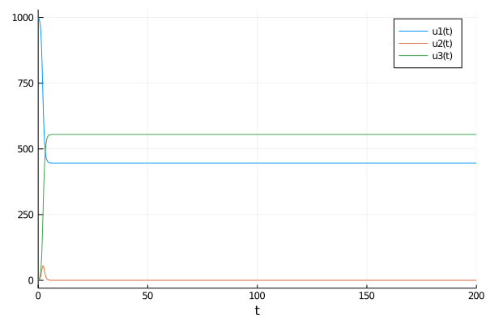

# markdown 


## これは


```julia
using DifferentialEquations
using Plots;gr()
```


    Plots.GRBackend()


```julia
function SIR!(du,u,p,t)
    S,I,R=u
    b,g=p
     du[1]=-b*S*I
     du[2]=b*S*I-g*I
     du[3]=g*I
end
```


    SIR! (generic function with 1 method)


```julia
u0=[1000,1,0]
```


    3-element Array{Int64,1}:
     1000
        1
        0


```julia
p=[0.008,5.5]
```


    2-element Array{Float64,1}:
     0.008
     5.5


```julia
tspan=(0.0,200.0)
```


    (0.0, 200.0)


```julia
prob=ODEProblem(SIR!,u0,tspan,p)
sol = solve(prob)
```


    retcode: Success
    Interpolation: automatic order switching interpolation
    t: 55-element Array{Float64,1}:
       0.0
       0.0002570011791475739
       0.002827012970623313
       0.02626954971724193
       0.08832858301054829
       0.18742012151399529
       0.3137931811603578
       0.4761668278425806
       0.6721398254259938
       0.9051971857042331
       1.1777905006831548
       1.4990350212134822
       1.8681881636327926
       ⋮
      30.957637652273966
      32.72783201924531
      34.538775342609995
      38.208752304179974
      42.07069775889462
      46.99639960836715
      53.725368934305
      63.69758472122394
      79.93490575454058
     109.64929628812109
     174.86290563550966
     200.0
    u: 55-element Array{Array{Float64,1},1}:
     [1000.0, 1.0, 0.0]
     [999.9979433320457, 1.000642707281703, 0.0014139606726242167]
     [999.9773040470981, 1.0070923082113883, 0.0156036446905336]
     [999.7828143675428, 1.067854293245195, 0.14933133921209904]
     [999.2096635730602, 1.2467653031235781, 0.5435711238163261]
     [998.0901682178004, 1.5955670213415425, 1.3142647608581133]
     [996.2011007865827, 2.1821825447717162, 2.6167166686455934]
     [992.735772329257, 3.251843626711938, 5.0123840440311]
     [986.2769387645683, 5.223123552053725, 9.49993768337803]
     [973.5559039956067, 9.019083536933708, 18.425012467459624]
     [947.5749110610501, 16.40375548566386, 37.02133345328608]
     [893.6375768513968, 30.049812192992064, 77.31261095561119]
     [795.5803433921873, 48.19984170569086, 157.21981490212195]
     ⋮
     [446.20542572964, 4.552719406835002e-7, 554.794573815088]
     [446.2054256031531, 3.868717277480295e-7, 554.7945740099751]
     [446.20542558899996, 3.7921823828774227e-7, 554.7945740317817]
     [446.205424744277, -7.758269048544448e-8, 554.7945753333056]
     [446.205424917301, 1.5983509697242604e-8, 554.7945750667154]
     [446.2054248816813, -3.278535914450665e-9, 554.7945751215972]
     [446.2054248888945, 6.221508021646827e-10, 554.7945751104833]
     [446.20542488756195, -9.845874404295689e-11, 554.7945751125364]
     [446.20542488776505, 1.1383927027129605e-11, 554.7945751122235]
     [446.2054248877425, -8.177066087499355e-13, 554.7945751122583]
     [446.2054248877441, 2.9159090121264555e-14, 554.7945751122559]
     [446.205424887744, -2.4065893329783144e-15, 554.794575112256]


```julia
plot(sol)
```





```julia
r0=0.008*1000/5.5
```


    1.4545454545454546


```julia

```
